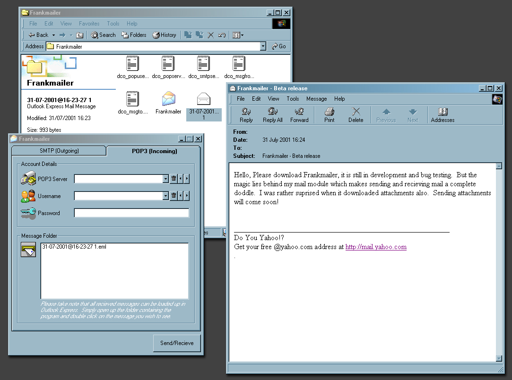



## Frankmailer \*\*\*Send & Recieve Email\!\!\!\*\*\*

### Description

This is my latest release of Frankmailer email suite. It enables you to send email and recieve email, received email is not limited in any sence what so ever, it handles attachments superbly and saves the downloaded message in Outlook email format, so you can simply double click on the message in Frankmailer and it will load it into Outlook. Sent email does not include attachments as yet. The module that sends and recieves email is totally independant and can be used in any aplette, its designed to run silently in the background without popping up errors, it just suffers and tries again. Its well worth a look at, please download it and for once im going to ask for loads of votes please!!! This took me a whole afternoon to write!!!
 
### More Info
 

             |
---                |---
**Submitted On**   |2001-07-31 23:47:44
**By**             |[Niknak\!\!](https://github.com/Planet-Source-Code/PSCIndex/blob/master/ByAuthor/niknak.md)
**Level**          |Advanced
**User Rating**    |4.8 (62 globes from 13 users)
**Compatibility**  |VB 6\.0
**Category**       |[Internet/ HTML](https://github.com/Planet-Source-Code/PSCIndex/blob/master/ByCategory/internet-html__1-34.md)
**World**          |[Visual Basic](https://github.com/Planet-Source-Code/PSCIndex/blob/master/ByWorld/visual-basic.md)
**Archive File**   |[Frankmaile238397312001\.zip](https://github.com/Planet-Source-Code/niknak-frankmailer-send-recieve-email__1-25689/archive/master.zip)

